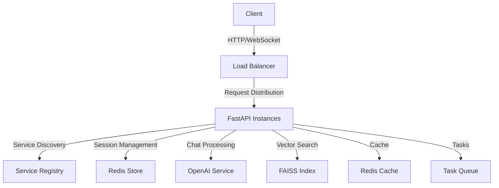

# OpenAI Chatbot Project

## 📋 Project Description

This project is an advanced chat application that leverages OpenAI's powerful language models to provide intelligent responses. Built with a modern tech stack, it combines FastAPI backend with a responsive frontend, featuring load balancing, service discovery, and session management.

### 🎯 Purpose

- Create a scalable, intelligent chatbot interface using OpenAI's GPT models
- Provide fast and reliable responses through efficient API integration
- Implement vector-based search capabilities for improved response accuracy
- Enable real-time chat functionality with WebSocket support
- Ensure high availability through load balancing and service discovery

## 🛠️ Technologies Used

### Backend (35%)
- **FastAPI**: High-performance Python web framework
- **Python 3.11+**: Core programming language
- **OpenAI API**: For natural language processing
- **FAISS**: Vector similarity search library
- **Redis**: Session management and caching
- **Uvicorn**: ASGI server implementation

### Infrastructure (30%)
- **Load Balancer**: Custom implementation for request distribution
- **Service Discovery**: Automatic service registration and health checks
- **Session Management**: Redis-based session storage
- **Task Queue**: Asynchronous task processing

### Frontend (25%)
- **HTML/Jinja2**: Template-based structure
- **JavaScript**: Client-side functionality and WebSocket handling
- **CSS**: Responsive design and styling

### DevOps (10%)
- **Docker**: Containerization
- **Docker Compose**: Multi-container orchestration
- **NGINX**: Reverse proxy and load balancing

## ⭐ Key Features

### 1. High Availability Architecture
- Load balancing across multiple instances
- Automatic service discovery and registration
- Health monitoring and failover
- Scalable infrastructure

### 2. Intelligent Chat Processing
- Real-time message processing
- Context-aware responses
- Natural language understanding
- Message history management

### 3. Advanced Search & Memory
- FAISS-powered vector similarity search
- Efficient query processing
- Memory management for chat context
- Knowledge base integration

### 4. Robust API Layer
- RESTful API endpoints
- WebSocket support
- Rate limiting and caching
- Comprehensive error handling

### 5. Security & Performance
- Input validation and sanitization
- Performance monitoring and logging
- Rate limiting protection
- Secure session management

## 🔧 Technical Architecture



## Project Structure

```
OpenAI Chatbot Project/
├── app/                          # Main application directory
│   ├── __init__.py               # Python package initializer
│   ├── main.py                   # FastAPI main application file
│   ├── error_handlers.py         # Error handling logic
│   ├── memory.py                 # Chat history memory management
│   ├── models/                   # Data models directory
│   │   ├── __init__.py
│   │   ├── message.py            # Message model definitions
│   ├── routers/                  # API routes directory
│   │   ├── __init__.py
│   │   └── chat.py               # Chat endpoints
│   ├── handlers/                 # Handlers directory
│   │   └── message_handler.py    # Message processing logic
│   ├── services/                 # Services directory
│   │   ├── __init__.py
│   │   └── chat_service.py       # Chat service logic
│   └── exceptions.py             # Custom exception classes
├── common/                       # Common modules directory
│   ├── websocket_manager.py      # WebSocket management interface
├── services/                     # External services directory
│   ├── __init__.py
│   └── openai_service.py         # OpenAI API integration
├── config/                       # Configuration files
│   ├── __init__.py
│   ├── logging_config.py         # Logging settings
│   ├── faiss_config.py           # FAISS vector DB settings
│   └── settings.py               # Application settings
├── load_balancer/                # Load balancer
│   ├── __init__.py
│   └── balancer.py               # Load balancing logic
├── middleware/                   # Middleware
│   ├── __init__.py
│   └── error_logging.py          # Error logging middleware
├── scripts/                      # Helper scripts
│   ├── __init__.py
│   └── vectorization.py          # Vectorization processes
├── service_discovery/            # Service discovery
│   ├── __init__.py
│   └── discovery.py              # Service discovery logic
├── session/                      # Session management
│   ├── __init__.py
│   └── redis_store.py            # Redis session store
├── templates/                    # HTML templates
│   └── index.html                # Main page template
├── static/                       # Static files
│   ├── css/                      # CSS files
│   └── js/                       # JavaScript files
├── utils/                        # Utility tools
│   ├── __init__.py
│   ├── helpers.py                # General helper functions
│   ├── cache_manager.py          # Cache management
│   ├── decorators.py             # Custom decorators
│   ├── health_check.py           # Health check
│   ├── performance_logger.py     # Performance logging
│   ├── rate_limiter.py           # Rate limiting
│   ├── task_queue.py             # Task queue
│   └── backup_manager.py         # Backup management
├── tests/                        # Test files
│   ├── __init__.py
│   ├── test_exceptions.py        # Exception tests
│   ├── test_helpers.py           # Helper function tests
│   ├── test_main.py              # Main application tests
│   ├── test_openai_services.py   # OpenAI service tests
│   └── test_vector_store.py      # Vector store tests
├── .coverage                     # Coverage report file
├── .coveragerc                   # Coverage configuration
├── .env                          # Environment variables
├── Dockerfile                    # Docker configuration
├── docker-compose.yml            # Docker Compose configuration
├── nginx.conf                    # Nginx web server configuration
├── pytest.ini                    # Pytest configuration
├── requirements.txt              # Python dependencies
├── setup.py                      # Package configuration
└── README.md                     # Project documentation
```