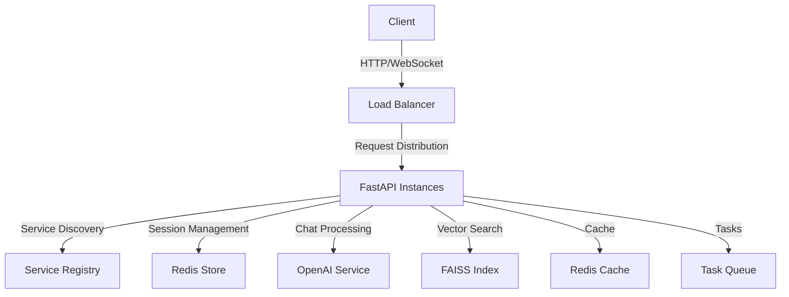

# OpenAI Chatbot Project

## 📋 Project Description

This project is an advanced chat application that leverages OpenAI's powerful language models to provide intelligent responses. Built with a modern tech stack, it combines a FastAPI backend with a responsive frontend, featuring load balancing, service discovery, and session management.

## 🎯 Purpose

- Create a scalable, intelligent chatbot interface using OpenAI's GPT models
- Provide fast and reliable responses through efficient API integration
- Implement vector-based search capabilities for improved response accuracy
- Enable real-time chat functionality with WebSocket support
- Ensure high availability through load balancing and service discovery

## 🛠️ Technologies Used

### Backend (35%)
- **FastAPI**: High-performance Python web framework
- **Python 3.11+**: Core programming language
- **OpenAI API**: For natural language processing
- **FAISS**: Vector similarity search library
- **Redis**: Session management and caching
- **Uvicorn**: ASGI server implementation

### Infrastructure (30%)
- **Load Balancer**: Custom implementation for request distribution
- **Service Discovery**: Automatic service registration and health checks
- **Session Management**: Redis-based session storage
- **Task Queue**: Asynchronous task processing

### Frontend (25%)
- **HTML/Jinja2**: Template-based structure
- **JavaScript**: Client-side functionality and WebSocket handling
- **CSS**: Responsive design and styling

### DevOps (10%)
- **Docker**: Containerization
- **Docker Compose**: Multi-container orchestration
- **NGINX**: Reverse proxy and load balancing

## ⭐ Key Features

### 1. High Availability Architecture
- Load balancing across multiple instances
- Automatic service discovery and registration
- Health monitoring and failover
- Scalable infrastructure

### 2. Intelligent Chat Processing
- Real-time message processing
- Context-aware responses
- Natural language understanding
- Message history management

### 3. Advanced Search & Memory
- FAISS-powered vector similarity search
- Efficient query processing
- Memory management for chat context
- Knowledge base integration

### 4. Robust API Layer
- RESTful API endpoints
- WebSocket support
- Rate limiting and caching
- Comprehensive error handling

### 5. Security & Performance
- Input validation and sanitization
- Performance monitoring and logging
- Rate limiting protection
- Secure session management

## 🔧 Technical Architecture



## 📂 Project Structure

```
OpenAI Chatbot Project/
├── app/
│   ├── __init__.py
│   ├── main.py
│   ├── error_handlers.py
│   ├── memory.py
│   ├── models/
│   │   ├── __init__.py
│   │   ├── message.py
│   ├── routers/
│   │   ├── __init__.py
│   │   └── chat.py
│   ├── handlers/
│   │   └── message_handler.py
│   ├── services/
│   │   ├── __init__.py
│   │   └── chat_service.py
│   └── exceptions.py
├── common/
│   ├── websocket_manager.py
├── services/
│   ├── __init__.py
│   └── openai_service.py
├── config/
│   ├── __init__.py
│   ├── logging_config.py
│   ├── faiss_config.py
│   └── settings.py
├── load_balancer/
│   ├── __init__.py
│   └── balancer.py
├── middleware/
│   ├── __init__.py
│   └── error_logging.py
├── scripts/
│   ├── __init__.py
│   └── vectorization.py
├── service_discovery/
│   ├── __init__.py
│   └── discovery.py
├── session/
│   ├── __init__.py
│   └── redis_store.py
├── templates/
│   └── index.html
├── static/
│   ├── css/
│   └── js/
├── utils/
│   ├── __init__.py
│   ├── helpers.py
│   ├── cache_manager.py
│   ├── decorators.py
│   ├── health_check.py
│   ├── performance_logger.py
│   ├── rate_limiter.py
│   ├── task_queue.py
│   └── backup_manager.py
├── tests/
│   ├── __init__.py
│   ├── test_exceptions.py
│   ├── test_helpers.py
│   ├── test_main.py
│   ├── test_openai_services.py
│   └── test_vector_store.py
├── .coverage
├── .coveragerc
├── .env
├── Dockerfile
├── docker-compose.yml
├── nginx.conf
├── pytest.ini
├── requirements.txt
├── setup.py
└── README.md
```

## 🚀 Getting Started

### Prerequisites

- Python 3.11+
- Docker
- Docker Compose
- Redis
- OpenAI API Key

### Installation

Clone the repository:

```sh
git clone https://github.com/zehraacer/Enterprise-Grade_OpenAI_Chatbot_Platform.git
cd Enterprise-Grade_OpenAI_Chatbot_Platform
```

Create and activate a virtual environment:

```sh
python3 -m venv venv
source venv/bin/activate
```

Install dependencies:

```sh
pip install -r requirements.txt
```

Set up environment variables:
Create a `.env` file in the root directory and add your configuration:

```env
OPENAI_API_KEY=your_openai_api_key
REDIS_URL=redis://localhost:6379/0
```

Run the application:

```sh
python -m uvicorn app.main:app --reload
```

### Using Docker

Build and run the Docker containers:

```sh
docker-compose up --build
```

## 🧪 Running Tests

To run the tests, use the following command:

```sh
pytest
```

## 🤝 Contribution

Contributions are welcome! Please fork the repository and create a pull request. For major changes, please open an issue first to discuss what you would like to change.

## 📄 License

This project is licensed under the MIT License. See the LICENSE file for details.

## 📧 Contact

For any inquiries or support, please contact [zehraacer](https://github.com/zehraacer).
